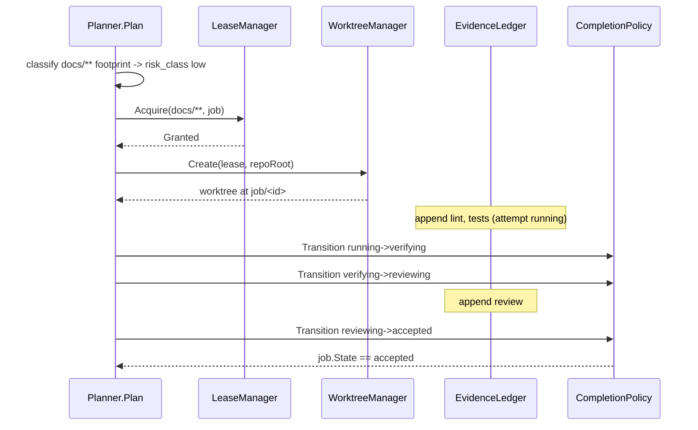

# Jobs, DAG, Leases

The `jobs` cascade.db domain (R-14.5, owned by Epic AC) hosts seven
tables, materialized by `internal/jobs` via the shared portable migration
builder.

## Schema

| Table | Purpose | Key fields |
|---|---|---|
| `jobs_job` | one row per DAG-node job | id, state, capabilities[], mutable_scope, risk_class, min_task_class, node_requirements, timeout_seconds, cost_ceiling, priority |
| `jobs_task_dependency` | deps[] edges | job_id, depends_on_job_id |
| `jobs_execution` | one row per attempt (R-16.33) | id, job_id, attempt, state, started_at, ended_at |
| `jobs_execution_result` | one outcome per execution | execution_id, output_summary, error_kind, error_message, artifact_refs[] |
| `jobs_artifact` | one produced file/blob | id, job_id, execution_id, kind, blob_key (BLAKE3), path |
| `jobs_resource_lease` | the one-mutable-writer lease record | repo_id + scope_glob (natural key), holder, issued_at, ttl_seconds, renew_count, journal_ref |
| `jobs_worktree` | one checked-out working tree | path (key), lease ref, repo, branch |

No `jobs_ci_attestation` table exists; AF/S-65.T4 owns it.

## Job state machine (R-16.37, amended by R-21.140)

```
pending -> leased -> running -> verifying -> reviewing -> accepted
                                                         -> rejected
any non-terminal -> cancelling -> cancelled
any non-terminal -> failed
```

Unknown or unparseable state decodes to `failed` — never a permissive
zero value. Four transitions are **policy-reserved** and refused on the
public store path with a typed error: `running->verifying`,
`verifying->reviewing`, `reviewing->accepted`, `reviewing->rejected`.
Only `internal/policy`, through `PolicyTransitionAllowed`, may invoke
them (S-60.T3 wires the real caller).

## W9 columns (inert here; semantics owned elsewhere)

- `jobs_job.consecutive_failed_attempts` (R-21.84) — increment/reset/wake
  debounce owned by AP/S-81.T3.
- `jobs_job.consequence_class`, `jobs_artifact.consequence_class`
  (R-21.99, closed set `trivial`/`normal`/`consequential`) — derivation
  from the AC/S-59.T4 risk class owned by AQ/S-83.T4.
- `jobs_job.data_class` (request floor) and `jobs_artifact.data_class`
  (IMMUTABLE) (R-21.94) — lattice join owned by AQ/S-83.T1-T4.

## W6 fencing + liveness columns (inert here; semantics owned elsewhere)

- `jobs_resource_lease.epoch` (R-21.139, monotonic per repo id + scope)
  and `.state` (closed set `held`/`renewing`/`expired_unconfirmed`/
  `expired_orphaned`/`released`) — the fence CHECK and reclaim are
  AC/S-59.T2's.
- `jobs_execution.pgid` and `.heartbeat_at` (R-21.140/R-21.172), plus the
  `abandoned` execution state — the liveness probe and quarantine sweep
  are AC/S-59.T3's; the heartbeat reaper is AC/S-59.T5's.
- `JobState`'s non-terminal `cancelling` — the sole gateway into
  `cancelled` — with the verified-termination gate on
  `cancelling->cancelled` owned by AC/S-59.T5 (driver side: AD/S-61.T1).

## Lease model: one mutable writer per lease scope (AC/S-59.T2)

`LeaseManager` (`lease.go`/`lease_query.go`/`lease_expiry.go`/
`lease_fence.go`/`lease_events.go`) is the DECIDED authority: two
requests whose scopes intersect never both hold a lease at once.

**Scope normalization (R-21.168, superseding R-16.37's doublestar-
intersection wording).** A caller pattern is expanded at acquire time to
its minimal repo-relative directory-prefix cover: a trailing `/**` is the
only wildcard kept in the normalized, stored form, and a literal
(non-wildcard) pattern is read as a FILE path — reduced to its own
parent directory, never assumed to itself be the directory to lease. Any
other wildcard placement (a mid-segment `*`, a `**` not at the very end,
a bare trailing `*`) is rejected at acquire with a typed error naming the
offending segment. `github.com/bmatcuk/doublestar/v4` validates the
caller's glob syntax and finds the literal/meta split point;
intersection is then a total, decidable test — one normalized prefix is
a prefix of, or equal to, another — checked over every pair in each
side's set. Examples: `internal/jobs/**` and `internal/jobs/lease.go`
intersect (the second reduces to `internal/jobs`, a prefix match);
`internal/jobs/**` and `internal/nodes/**` do not.

**Defaults (R-16.37 `[jobs].lease` verbatim).** `ttl=2h`,
`renew_every=15m`, `expiry_grace=10m`, as the typed `LeaseDefaults`
struct (`DefaultLeaseDefaults()`), injected into `LeaseManager` by the
daemon composition root. Registering these as config keys in
`internal/runtime/config` is a named follow-up, not this ticket's
files_scope — see lease.go's `LeaseDefaults` doc comment for the full
contract-vs-files_scope note.

**Acquire/queue.** `Acquire` runs the conflict scan and the grant inside
one `*sql.Tx` over the Store's single-connection db, so two concurrent
Acquire calls for intersecting scopes can never both observe "no
conflict". No conflict grants a `held` row stamped with the next epoch
for that (repo id, normalized scope); a conflict returns a typed
contended result naming the conflicting lease, and the requester stays
queued (no CLI/RPC re-attempt surface here — that is S-60.T1's).

**Renew/expiry (R-21.139/R-21.177).** `Renew` accepts while `now <= last
issue/renew + ttl + expiry_grace`, incrementing `renew_count` and
re-arming `ttl`. `SweepExpired` moves any lease past that deadline to
`expired_unconfirmed` and raises exactly one `stall` attention item
(idempotent on (kind, source_ref) = the lease's stable entity id,
`lease:<repo>:<scope>`) — the lease is NEVER transferred to another
holder at this point; `expired_unconfirmed` still admits no contender.

**Fence and closed state machine.** The closed state set is `held` /
`renewing` / `expired_unconfirmed` / `expired_orphaned` / `released`.
`Fence(ctx, repoID, scopeGlob, epoch)` is the single validation entry
point every lease-scoped mutation (worktree add/remove, job-branch
commit/CI dispatch, integration/release, evidence write) presents its
believed epoch to; a mismatch refuses with `ErrLeaseFenced` and raises
the same idempotent attention item. `Reclaim` is the only path out of
`expired_unconfirmed`: it probes the holder's most recently recorded
execution pgid through the injected `ProcessLivenessProbe`
(`unixLivenessProbe`'s signal-0 check on unix,
`windowsLivenessProbe`'s handle/exit-code check on windows) — a dead
pgid moves the row to `expired_orphaned`, advances the epoch, and frees
the scope for a new grant; a live pgid changes nothing, and the
contender stays queued. A resuming job re-acquires by holder-id match at
the new epoch.

**Release.** Two paths: explicit `Release(repoID, scopeGlob, epoch)`,
and `store_job.go`'s `PutTransition` release-on-terminal hook
(`Store.onTerminal`, wired via `WireLeaseRelease`) firing once a job
lands in any of its four terminal states. Per R-21.193, the AH/S-70.T3
stall transition calls the SAME explicit `Release` path with the lease's
current epoch: a current-epoch stall release moves the lease to
`released` and wakes queued contenders, while a stale-epoch stall
release is refused with `ErrLeaseFenced` — the same fence check every
other mutation gets.

**Controller-singleton authority (R-21.169).** `Acquire`, `Release` and
`SweepExpired` all refuse with the typed `ErrNotController` unless the
injected `isController` func reports true — a node daemon never writes
lease state.

**Journal + event bus.** Every lifecycle transition
(acquired/renewed/released/expired/reclaimed/contended) appends to an
`internal/fleet/journal` entity log keyed by the lease's stable entity
id, and publishes on `internal/events`' `jobs.lease` namespace
(`EventLeaseAcquired`/`Contended`/`Renewed`/`Released`/`Expired`) — the
T5 scheduler's and S-60.T1's filtered-SSE feed's input. No RPC methods
are registered by this ticket.

**Forward note (R-21.141, not implemented here).** The W9 reservation is
the sole dispatch door; AC leases become subordinate claims it creates.
Routing acquisition through `economics.Reserve` is AO/S-79.T4's.

## Worktree manager: one isolated tree per lease (AC/S-59.T3)

`WorktreeManager` (`worktree.go`/`worktree_mutex.go`/`worktree_store.go`/
`worktree_events.go`/`worktree_list.go`/`worktree_sweep.go`/
`worktree_quarantine.go`/`worktree_snapshot.go`) drives the REAL `git`
binary over `os/exec` (no CGO) so that every held lease owns exactly one
isolated working tree at the R-16.37 constants verbatim: root
`<repo>/.cascade/worktrees/job-<id>`, branch `job/<id>`, where `<id>` is
the lease-holding job id (`ResourceLease.Holder`).

**Create/converge.** `Create(lease, repoRoot)` runs `git worktree add
<path> -b <branch>` and persists a `Worktree` row (`{lease ref, repo,
path, branch}`, S-59.T1's model) — or, if a row for the SAME lease
already resolves to a path still on disk, returns it as-is with no
second `add` and no error (daemon-restart/resume safety).

**Remove.** `Remove(lease)` runs `git status --porcelain` on the
per-lease path first: a dirty tree refuses with a typed error NAMING the
path, never a silent force. Only a verified-clean tree is actually
removed (`git worktree remove <path>` + row delete).

**Lifecycle wiring (acquired -> create, released/expired -> remove).**
`apply`/`Run` (`worktree_events.go`) consume `lease_events.go`'s own
`jobs.lease` bus events IN-PACKAGE (no cross-package seam — same
package as the publisher) and dispatch acquired to `Create`, released
and expired to `Remove`; contended/renewed are no-ops. Since a lease
event carries only a repo ID, never a filesystem path, `RepoRootResolver`
is the seam this ticket defines to cross that gap — the daemon
composition root wires the only honest implementation available today,
`IdentityRepoRootResolver` (repo id IS the root), and a future repo-id
registry swaps it without touching `Create`/`Remove`/`Run`. The daemon
composition root (`internal/daemon/subsystems.go`'s
`RegisterWorktreeSweep`, `internal/daemon/subsystems_worktree.go`'s
`RegisterWorktreeManager`) is the only production caller: no CLI verb and
no RPC method exist for any of this (`fleet jobs`/`fleet leases` are
AC/S-60.T1's).

**Orphan sweep at daemon start (R-21.140/R-21.177).**
`WorktreeManager.Sweep`, wired at subsystem startup via
`RegisterWorktreeSweep`, reconciles every stored row: it removes ONLY a
worktree whose lease is `released` AND whose tree is clean (`git status
--porcelain` empty) AND whose holder execution's recorded `pgid` (S-59.T1
column, written at spawn by AD/S-61.T1) has no live process
(`ProcessLivenessProbe`, the SAME seam `lease_fence.go`'s `Reclaim`
uses). A live pgid blocks the sweep ENTIRELY — never removed, never
quarantined. An `expired_unconfirmed` lease, or one this store has no
record of, is left untouched (fail-closed). `git worktree prune` runs
once per repo this pass actually removed or quarantined something in
(including a row whose directory already vanished outside this manager,
clearing whichever stale admin metadata that leaves behind). A second
sweep over an unchanged state returns zero deltas by construction.

**Quarantine, never delete, a dirty orphan (R-21.140/R-21.177).** A
released, dead-pgid orphan whose tree is DIRTY is MOVED (never deleted)
to `<repo>/.cascade/worktrees/quarantine/job-<id>`; git admin metadata is
then detached with `git worktree remove --force`, targeting the now-
vacated original path, AFTER the move. The row is re-keyed to the new
path (the schema carries no quarantine flag — S-59.T1's migration is out
of this ticket's files_scope — so "quarantined" is the path shape
itself: under `.../worktrees/quarantine/`, excluded from the sweep's own
candidate set, which is what makes a second sweep over it a no-op).
Journal metadata records `{lease id, epoch, holder job id, pgid probe
result, dirty file count, moved-from, moved-to}`, and exactly one
`R/S-39.T1` attention item is raised (idempotent on `(kind, source_ref)`,
the same rule `lease_events.go`'s fenced/expired paths use).

**Porcelain parser (`worktree_list.go`).** A strict, fail-closed parser
over `git worktree list --porcelain`: an unrecognized line, or an
attribute line before its block's own `worktree ` header, is a typed
parse error, never a guessed entry. `FuzzWorktreePorcelain`
(`worktree_list_test.go`), seeded from a real capture (provenance:
`internal/jobs/testdata/README.md`), runs 30s of adversarial input with
zero panics.

**Immutable candidate snapshot (R-21.147).** `Snapshot(lease, epoch,
selectedUntracked)` stages ONLY the explicitly selected untracked paths
and returns a content-addressed tree hash stamped with the epoch,
refusing under a stale epoch through the S-59.T2 `Fence` entry point
(`FenceFunc`, a method-value seam over `(*LeaseManager).Fence`).
CONTRACT-VS-TREE NOTE: the plan text names `git add --intent-to-add` as
the staging step; verified against real git, `--intent-to-add` records a
path's presence with a null blob and `write-tree` emits the canonical
empty-tree hash for it regardless of content — so this file stages with
a real `git add`, takes the tree, then `git reset --` to leave the
worktree's ordinary staging area exactly as it found it. Attempt-scoped
run ids, cancellation tombstones and late-result rejection belong to
AF/S-65.T2, which binds a CI run and an acceptance re-run to this tree
hash; they are not implemented here.

**Git-metadata serialization (R-21.177, `worktree_mutex.go`).** Every
`worktree add`/`remove`/`prune`/`write-tree` runs behind a per-repository
in-process mutex with bounded backoff on an observed `index.lock` (50ms
base, doubling, 5 attempts, 2s ceiling) and a typed error at the ceiling
— parallel admitted leases on one repository never race `.git/worktrees`
or `index.lock`.

**Boundaries.** No CLI verb, no RPC method, no lease semantics (S-59.T2's),
no scheduling/admission (S-59.T5's), no DAG planning (S-59.T4's). The
`.cascade/` gitignore entry is untouched (R-16.37: owned by the E
generator).

## Migration and owner registration

`internal/jobs.MigrationSet()` claims schema_version 5 in cascade.db's
single global version sequence (bootstrap=1, context/scope=2,
retrieval/lifecycle=3, providers/registry=4). `internal/storage/
domains.go`'s `AllDomains` entry for `DomainJobs` now names
`internal/jobs` as the owner package.

## DAG planner (AC/S-59.T4)

`Planner.Plan(ctx, PlanInput, SessionScope) (ExecutionDag, error)` is the
`conductor.plan` seam (the RPC alias over this Go seam lands with
AP/S-82.T1, R-21.39). `SessionScope` (E/S-08.T4) is a REQUIRED input,
resolving the repository root the risk classifier's content probes read.

`PlanInput` is a ticket|intent union: `TicketInput {ID, ModelClass,
DependsOn, Footprint}` plus five pass-through fields (`Capabilities`,
`NodeRequirements`, `Timeout`, `CostCeiling`, `Priority`) the planner
carries verbatim, never synthesizes; `IntentInput {Intent}` plus the same
pass-through fields. Each `Plan` call returns a single-node
`ExecutionDag`: a ticket's node has `Deps` from `DependsOn` and
`MutableScope` from `Footprint`; an intent's node has empty `Deps` and
`MutableScope`. `DagNode` carries EXACTLY `{Capabilities, Deps,
MutableScope, RiskClass, MinTaskClass, NodeRequirements, Timeout,
CostCeiling, Priority}` plus its id.

`MinTaskClass` is `conductor.ModelClassToTaskClass(ModelClass)` (the
06 §5.18 mapping: mech/build/heavy -> code, review -> review, arbiter ->
arbitrate) -- an unknown `ModelClass` is a typed `KindInvalidInput`
error, never a default task class. A dependency cycle (including a
ticket declaring itself as its own dependency) and an empty input are
also typed `KindInvalidInput` errors; cycle detection is a general
depth-first coloring check (`validateAcyclic`) that also covers a future
multi-node DAG, not only the single-node W6 case.

Consumers: T5's scheduler (`advance(dag, event)`) consumes
`ExecutionDag`; S-60.T1/T2/T3 and AH/S-69.T1 consume `RiskClass` +
`GateSet`; AH/S-69.T3 is the PEWS 17-field -> `PlanInput` compiler (this
package imports no `plugins/pbd`).

## Risk classifier and gate sets (AC/S-59.T4)

The R-21.182 footprint is the union of pre-image paths, post-image paths
(both folded into the caller's declared footprint) and an optional
injected `ReachabilityFn func(ctx, paths) ([]string, error)` (R-21.257):
`nil` means no expansion (the W6 default -- AG/S-67.T3 in W7 is the
first implementer); a non-nil seam is called once and its paths join the
union; a seam ERROR fails closed to Critical, never to a lower class and
never to a silent path-only fallback.

**Unlowerable Critical floor (R-21.182, NORMATIVE):** any footprint path
that is a gate table, a classifier table, a policy file, an egress-class
file or a generated harness artifact classifies Critical, evaluated
BEFORE the R-16.37 rules below; no later rule, reclassification or
config key lowers a floor hit. R-21.182 names the five categories by
role; this ticket's own derivation maps them to concrete paths
(`internal/build`'s gate files; this package's own `risk.go`/
`riskgates.go` plus `internal/conductor/task_classes.go`;
`internal/policy/**`; `internal/secrets/**`; `internal/repo/templates/**`
and `.github/workflows/**`) -- extending the list is expected as later
tickets add their own tables; narrowing it needs a T0 ruling.

**R-16.37 rules, first match, in this order:**

| Class | Rule |
|---|---|
| Critical | `internal/secrets/**`, `internal/policy/**`, `internal/elevation/**`, `providers/*/auth*`, `**/migrations/**` containing DROP/ALTER, `.goreleaser.yaml`, `install.sh` |
| High | >=2 distinct repositories in the plan; any `**/migrations/**` or `*.sql` path; an existing file importing `sync/atomic` or containing `go func`; any `pkg/**` path (a potential exported-signature change, unprovable at plan time) |
| Low | only `docs/**` and `*.md` paths |
| else | Normal (including an empty or unresolvable footprint) |

Content probes (the DROP/ALTER marker, `sync/atomic`, `go func`) read
only EXISTING files under the classifier's probe root; an absent path
contributes a path-rule match only.

**Gate sets** (`RiskClass -> GateSet`, DECIDED, additive by severity —
low < normal < high < critical):

| Class | Gates |
|---|---|
| Low | format + static + targeted verification |
| Normal | Low + build + lint + targeted tests + code review + integration checks |
| High | Normal + independent QA + adversarial review + affected/full integration CI + clean-node verification |
| Critical | High + explicit human approval + rollback evidence + release gate |

AH/S-69.T1 owns the policy-table-as-data form this mapping encodes.

## Job templates (AC/S-60.T2)

`JobTemplate.Resolve(ctx) (DagNode, error)` is the typed-template seam
for the six DECIDED work kinds (`implement`, `review`, `adversarial`,
`qa`, `ci`, `integrate`). `TemplateRegistry.By(kind)` resolves a kind to
its `JobTemplate`; an unrecognised kind returns the typed
`ErrUnknownTemplateKind`, never a panic or a `(nil, nil)` return.
`TemplateRegistry.Register` is exported and additive, so AH/S-69.T2
extends the same registry with its own CR/QA/adversarial-reviewer
templates rather than building a parallel one.

Because `Resolve` takes only a `context.Context` (no second parameter),
per-invocation data (the node's id, its declared footprint, its
`depends_on` edges and the five pass-through fields) travels on ctx via
`TemplateContext` / `WithTemplateContext`. A nil ctx, a ctx with no
attached `TemplateContext`, or a `TemplateContext` with no id are all
typed refusals, never a zero-value `DagNode`.

Templates set ONLY the DECIDED `DagNode` field set -- no field was added
to `dag.go` for this ticket:

| Kind | mutable_scope | min_task_class | capabilities (added) | node_requirements (added) | risk_class |
|---|---|---|---|---|---|
| implement | ticket footprint | code | -- | -- | classifier |
| review | empty (read-only) | review | `review`, `family:distinct-from-author` | -- | Normal |
| adversarial | empty (read-only) | review | `review`, `adversarial` | -- | Normal |
| qa | empty (read-only) | review | -- | -- | Normal |
| ci | empty (read-only) | code | -- | `clean-room` | Normal |
| integrate | target subtree glob | code | -- | -- | Normal floor, classifier may elevate |

`implement` and `integrate` close over a `FootprintClassifier` at
construction (constructor injection, per this ticket's own HOW-2); the
production value (`defaultClassifier`) calls the SAME
`classifyFootprint` the DAG planner uses (risk.go), never a parallel
re-derivation. `review`/`adversarial`/`qa`/`ci` always report
`MutableScope = nil` regardless of what the caller's `TemplateContext`
carried -- these kinds never touch files, so a declared footprint would
misstate what the node does.

**Disclosed gap (K/S-23.T6):** the ticket contract names a "K/S-23.T6
FlowDecision" function this ticket should call to populate a DagNode's
gate set. K/S-23.T6 (`internal/conductor/flow.go`) ships `ParseVerdict`,
`Consensus` and `LoopStop` -- three pure functions over a MULTI-REVIEWER
verdict set collected at review-decision time, none of which produces a
gate set, and no such function exists under any other name. `DagNode`
also carries no gate-set field (S-59.T4's frozen field set). No template
here calls any of the three: doing so with synthetic single-entry input
just to satisfy the contract's wording would be fabricated wiring, not a
real integration. A risk class's gate set remains retrievable on demand
via `GateSetForRiskClass(node.RiskClass)` (or, with an overlay,
AH/S-69.T1's `EffectiveGateSet`) at whichever consumer needs it -- it is
never stored on the node itself.

The ">=2 distinct repositories" High-classification rule (risk.go) still
has no multi-repository carrier: `TemplateContext`, like `TicketInput`
before it, carries one footprint and one id, not a repository-id list,
so `defaultClassifier` still resolves through `singleRepository()`.

Consumer: `TemplateRegistry.By` + `WithTemplateContext` have no
production caller yet -- the composition root that would assemble a
real multi-node `ExecutionDag` from registered templates is AC/S-60.T3's
completion gate (`internal/build/testonly-allow.json` names both symbols
against that ticket).

## Reclassification at every checkpoint (R-21.146)

`Reclassify(ctx, planned RiskClass, actual ChangeFootprint,
leaseScopePrefixes []string, probeRoot string) (RiskClass, *Escalation,
outOfScope []string, error)` re-runs the classifier over the ACTUAL
footprint -- `ChangeFootprint{ChangedPaths, DependencyImpactPaths}`, the
candidate tree's real diff (AC/S-59.T3) plus the plan input's resolved
dependency impact -- at every lease checkpoint and once more before
acceptance.

**Monotonic:** within one attempt the class only increases. A derived
class at or below `planned` returns `planned` UNCHANGED (`esc == nil`,
never a downgrade). An increase returns a non-nil `*Escalation{From, To,
TriggeringPaths, InvalidatedGateSet, RequiredGateSet,
RequiredScopePrefixes}`: evidence gathered under `InvalidatedGateSet`
(the planned class's gates) is invalidated, `RequiredGateSet` (the
derived class's gates) applies, and `RequiredScopePrefixes` must be held
before the attempt continues.

**Scope containment** (R-21.146 with R-21.168): `outOfScope` names the
changed paths NOT covered by the lease's normalized scope prefixes,
independent of the derived class -- empty for an in-scope diff, every
offending path otherwise.

The gate that denies and requeues on escalation or containment violation
is AC/S-60.T3's; the checkpoint call site is AF/S-65.T2's — neither is
implemented here.

## Lifecycle stages and the risk-gate overlay (AH/S-69.T1)

`LifecycleStages()` returns the 13 R-16.13 DECIDED dev-shop stages, in
written order, as DATA (never prose prompts): intent, scope/understand,
plan, decompose+lease, implement, CR, QA, adversarial (risk-dependent),
integrate, clean-node CI, release/CD gate, accept, learn.
`ParseLifecycleStage` is fail-closed (`ErrUnknownLifecycleStage`, no
permissive zero value). `ReclassificationStages()` returns exactly
`{StagePlan, StageImplement, StageAccept}` -- R-21.146's three
mandatory reclassification points (plan time, every lease checkpoint
reached during implement, and immediately before acceptance) expressed
over the same enum.

**ONE risk model, R-16.70(b):** the RiskClass -> GateSet mapping has
exactly one representation -- `riskgates.go`'s `GateSetForRiskClass`
table and its `GateItem` enum, both AC/S-59.T4's. This section owns
only a TIGHTENING-ONLY overlay on top:

- `RiskGateOverlay` (`riskgates_overlay.go`) is a `map[RiskClass]GateSet`
  of per-class ADDITIONS only -- a removal is not representable in the
  type, so `EffectiveGateSet(rc, ov)` is structurally always a superset
  of `GateSetForRiskClass(rc)` and of the R-21.182 Critical floor's own
  gate set, for every overlay value.
- `EffectiveGateSet(rc, ov)` unions the table's result with `ov[rc]`,
  table order then overlay order, de-duplicated.
- `ParseGateItem`/`BuildRiskGateOverlay` validate raw gate-step names
  against `riskgates.go`'s own maximal set (`criticalGates`), never a
  second enumeration.

**`[policy.risk_gates]` config (08 §3, hot reload class):**
`internal/policy` cannot import this package (`internal/jobs` already
imports `internal/conductor` -> `internal/hooks/egress` ->
`internal/secrets` -> `internal/policy`, so the reverse edge cycles).
`internal/policy/risk_gates_config.go` therefore parses the overlay's
SHAPE only (a table; recognised class keys `low`/`normal`/`high`/
`critical`; string-list values) into a raw `map[string][]string`;
`jobs.BuildRiskGateOverlay` is where gate-step-name validation actually
happens, called from `cmd/cascade/daemon_unix_policy.go`'s
`validateRiskGateOverlay` BEFORE the config-reload swap
(validate-before-write) -- one layer above `internal/policy`, not
inside it.

**Monotonic reclassification (`risk_reclass.go`):** `RaiseRiskClass(prior,
observed, ov)` returns the higher of the two (severity order); an
observed class at or below prior is CLAMPED, never an error and never a
lowering. An increase returns `RiskEscalation{From, To,
InvalidatedGateSet, RequiresExpandedLease: true}`, naming
`EffectiveGateSet(prior, ov)` as the gate set the escalation
invalidates. `RiskEscalation` is a DISTINCT type from
`risk_reclassify.go`'s pre-existing `Escalation` (a different call site,
prior/observed vs. planned/actual, with a different field set the
ticket contract itself specified) -- the two cannot share a name in one
package without a field-set collision.

**`cascade policy risk explain <path...>`** (`cmd/cascade/policy_risk.go`)
classifies the R-21.182 union footprint (`--pre`, `--post`,
`--symbol-reach`, bare positional paths counting as both pre- and
post-image) through `ClassifyFootprint` (exported wrapper over this
package's own `classifyFootprint`) and reports `EffectiveGateSet`'s
result with each gate's provenance (table vs overlay) and `floor:
critical` with the matching path when the Critical floor resolved the
class. It ships CLI-only, running entirely locally (no daemon dial) --
the contract's JSON-RPC mirror was left unshipped rather than shipped
either unauthenticated or in violation of `internal/policy`'s own
handler/verb-registry invariant test; see the S-69.T1 journal.

## Completion gate and evidence ledger

The completion gate enforces "an agent saying done is evidence, not the
completion decision": `CompletionPolicy.Transition` is the only path
that may move a job across a policy-reserved edge (`running` ->
`verifying` -> `reviewing` -> `accepted`/`rejected`), and it checks
seven things before allowing one, in the order the evidence actually
needs (not the order the numbers in the ruling suggest, since the risk
reclassification step must run BEFORE the completeness check): caller
identity, state ordering, the evidence hash chain, risk reclassification
plus lease-scope containment, evidence completeness, the Critical-class
human-approval check, checkpoint binding, and an atomic commit at the
recorded ledger cursor.

**Evidence ledger** (`evidence.go`, `migration_evidence.go`): a per-job,
append-only table (`jobs_evidence`) of seven `EvidenceKind` values
(`build`, `lint`, `tests`, `review`, `adversarial`, `ci_attestation`,
`human_approval`) and four `ProducerCapability` values
(`controller-run`, `attestor`, `human-approval`, `agent-claim`). Rows
chain by a per-job `prev_hash` (SHA-256 over the canonical JSON of the
preceding row, a 32-zero-byte genesis), verified end to end by
`EvidenceLedger.Verify` before every gate evaluation. A repeated
`idempotency_key` is a no-op returning the existing row; there is no
UPDATE or DELETE path anywhere in this file's API. `agent-claim` rows
are recorded but never satisfy a gate on their own -- the completeness
check (`missingEvidence`) skips them explicitly.

**Producer authorization** (`evidence_authz.go`): every `Append`
presents `{execution_id, lease repo/scope, lease epoch}`. `ProducerAuthz`
refuses (typed `ErrEvidenceProducerDenied`, no row written) unless the
calling process is the controller (the same single-process identity
seam `LeaseManager` uses) AND the execution id resolves to a real
`jobs_execution` row AND the presented epoch survives the AC/S-59.T2
`LeaseFencer.Fence` check. `attestor_identity`'s required prefix
(`node:`, `daemon:`, or `approval:`) is derived from the row's
`EvidenceKind`, never chosen by the caller.

**Approval-token binding** (R-21.164): the human_approval check binds a
token to `{job_id, tree_hash, policy_version}` by reusing the real
I/S-18.T3 `ApprovalQueue.ConsumeToken`'s own action-hash binding --
`ApprovalScopeAction` hex-SHA256-encodes the three fields into a
64-character `Action` string (the queue's display-sanitization ceiling
rejects anything longer), so a token minted for a different job, tree
hash, or policy version fails the queue's own re-hash comparison. There
is no second scope field or second ledger; this is the SAME ledger
`internal/repo`'s inferred-fact store proved out for its own subjects
(R-21.202's satisfied-by-producer posture), reused rather than
duplicated.

**Live stall-detector wiring** (R-16.73, R-21.202, R-40.X18): every
denial publishes exactly one `jobs.gate.denied{job_id, session_id,
ticket_id, reason, attempt}` event on the real event bus (namespace
`jobs.gate`); a successful transition publishes none. R/S-39.T5's
`supervision.Detector` subscribes to this exact stream and normalizes
it into `StallSignal{Kind: gate-denied, ...}` -- proved end to end in
`gate_stall_integration_test.go` (real denials, real bus, real
detector), the live counterpart R/S-39.T5 itself could only verify
synthetically.

**Caller identity**: since `internal/policy` cannot import
`internal/jobs` (the conductor->egress->secrets->policy cycle), the
gate cannot call into a live `policy.Engine` to verify its caller.
`PolicyEngineIdentity{EngineID}` is compared against the `EngineID`
`CompletionPolicy` was constructed with -- a documented, ticket-local
trust boundary; AF/S-66.T1's hook-pack registration is the real
production caller that will thread the real engine id through.

## Scheduler (P1-E29-W6-S59-T5)

`Scheduler.Advance(ctx, dag, event, jobStates, activeLeases, governorFn)
ScheduleDelta` is the pure DAG-scheduling primitive: no side effects, no
DB calls, no lease acquisition. `governorFn` is the ONE admission seam
(`func(context.Context, governor.AdmissionRequest) (governor.Permit,
error)`, R-16.64) -- this package imports only `AdmissionRequest`/
`Permit` from `internal/fleet/governor`, never the concrete
`AdmissionController`.

**Admissibility**: a `DagNode` is admitted when every `deps[]` entry is
`accepted` and no active lease held by another holder intersects its
`mutable_scope` (T2's doublestar `Scope.Intersects`); an
`expired_unconfirmed` lease still counts as active (R-21.139) until a
`LeaseReclaimed` event frees it. Admissible nodes are ordered priority
descending, then node id ascending (deterministic tiebreak), and
`governorFn` is called at most once per admissible node per `Advance`
call -- on success the node lands in `LeasesToAcquire` carrying the
observed lease epoch (a fenced acquire) and the granted `Permit`, whose
`Release()` the coordinator calls on that node's terminal outcome.

**Idempotent cancel** (R-21.140/R-21.174): `CancelRequested` on
`accepted`/`rejected`/`cancelled`/`failed`/`cancelling` is a no-op
delta; on any other state it emits exactly one `->cancelling`
transition plus one outbox intent for the driver cancel effect. The
terminal `->cancelled` transition is emitted ONLY on
`TerminationConfirmed` (a confirmed process-group exit, or an executor
reconciliation reporting no live writer) -- never on the bare cancel
request itself.

**LeaseExpired** never mutates job state; it appends an
`AttentionRaised` `Event` to `EventsToEmit` so the coordinator can route
it onward (the real `supervision.Store` push already happens in
`lease_expiry.go`'s own sweep -- this is the scheduler's pass-through
signal, not a second write of the same item).

**Resume** (`Scheduler.Resume(ctx, store, journal, heartbeatInterval,
probes, compensate)`), called once at daemon start: reconciles the
R-21.148 transactional outbox by idempotency key
(`<site>:<job_id>:<attempt_generation>:<payload_hash>`, the five sites
spawn/lease-acquire/inbox-publish/ci-dispatch/integration) --
confirming an existing effect without re-performing it, marking an
absent one to re-perform under the same key, and COMPENSATING (never
advancing) a row whose owning job already reached a terminal state;
reaps executions whose `heartbeat_at` exceeds three
`heartbeatInterval` periods into `abandoned` with their result
rejected; then scans `running` jobs whose lease has passed
`ttl+expiry_grace` (2h10m, R-16.37) and re-enters them at `leased` --
but only for a job the REAL M/S-27.T1 journal (the `Reader` seam;
`internal/fleet/journal` is never imported directly from this package)
shows an actual replayed trail for, and never for a lease still
`expired_unconfirmed` (R-21.139/R-21.177; that scope waits for the
S-59.T2 reclaim path). The kill -9 test
(`scheduler_resume_test.go:TestResumeKill9MidDAG`) proves this against
a REAL child OS process SIGKILLed mid-write and the REAL on-disk
journal it left behind.

**Controller singleton** (R-21.169): `Advance` and `Resume` both refuse
with a typed permission error on a node daemon. This ticket reuses
`internal/nodes`' existing `Role`/`RequireController` primitive
(`P1-E36-W7-S72-T2`, which explicitly names AC/S-59.T5 as its intended
caller) rather than building a second advisory-lock mechanism, via
`scheduler_controller.go`'s `Guard`.

## Ownership boundaries

This domain ships the schema, records, state machine, typed store, DAG
planner, risk classifier, job templates, lifecycle stages, the
tightening-only risk-gate overlay, the `policy risk explain` CLI,
(P1-E29-W6-S59-T3) the worktree manager and orphan sweep above,
(P1-E29-W6-S59-T5) the scheduler/admission/resume/outbox above, and
(P1-E29-W6-S60-T3) the completion-gate engine and evidence ledger
above. It does not implement: the lease fence check/reclaim's own
composition (AC/S-59.T2 ships `Fence`/`Reclaim`, consumed here by both
the worktree manager and the completion gate; also `worktree_snapshot.go`'s
and `worktree_sweep.go`'s pgid PRODUCER via AD/S-61.T1's `SpawnResult`),
the DAG-assembly CLI/RPC surface (AC/S-60.T1, which mounts `fleet
jobs`/`fleet leases` and is the only place either surface is ever meant
to appear), the completion-gate hook-pack registration that gives
`CompletionPolicy` a real production caller (AF/S-66.T1), the
`ci_attestation` writer (AF/S-65.T4, the consumer of
`worktree_snapshot.go`'s tree hash), or a repo-id -> filesystem-path
registry (no such registry exists anywhere in this tree today;
`RepoRootResolver`'s `IdentityRepoRootResolver` is this ticket's
documented stand-in, swappable without touching `Create`/`Remove`/`Run`).

## PEWS compiler

`CompileTicket(PEWSContract, RiskGateOverlay) (PlanInput, GateSet, error)`
(`pews_compiler.go`) is the pure PEWS 17-field-to-`PlanInput` compiler.
`PEWSContract` (`pews_compiler_types.go`) mirrors the PEWS ticket
schema's 17 fields field-for-field without importing the schema's own
package: the import-boundary rule runs `plugins/providers` -> `pkg`
only, and Go's own `internal/` visibility separately makes that package
unreachable from here. The party holding a decoded ticket builds a
`PEWSContract` from it field-for-field; wiring that live caller is a
later integration point, not this compiler.

The 17-field map is NORMATIVE (`pews_compiler_fieldmap.go`): `id`,
`depends_on`, and the `files_scope` ADD+CHANGE+DELETE union map onto
`TicketInput{ID, DependsOn, Footprint}` verbatim -- the DAG planner's
own shape, no new `PlanInput` variant. Every other field has its own
named mapping function returning the value in its documented job/DAG
target shape (`job.name`, job metadata, one verification job per check
command, completion-gate evidence requirements, an integrate job), even
where no concrete Go type for that target exists yet in this tree.

`cr_level`/`qa_level` resolve to a declared `RiskClass`
(`pews_compiler_riskclass.go`) covering the complete canonical
`cr_level` form set: `CR-B` or `CR-A+CR-B`, and `QA-A` or `QA-B`, are
Normal; `CR-B+CR-C` or `CR-A+CR-B+CR-C`, and `QA-C`, are High. The
resolved class is the higher of the two; Critical is never derivable
from levels -- it is a footprint/domain classification, never a
`cr_level`/`qa_level` combination. `DeclaredGateSet` resolves that class
through the ONE risk-gate table, tightened by a `RiskGateOverlay`; no
second gate-set table is defined here.

`EffectiveTicketGateSet(declared, classifierDerived GateSet)`
(`pews_compiler_gateset.go`) is the union the compiler does NOT resolve
itself: the classifier-derived set needs `Planner.Plan`'s result, which
needs a `SessionScope` no `PEWSContract` carries, so the caller runs
`Planner.Plan` separately and unions its result with `CompileTicket`'s
declared set here. The classifier-derived set is an UNLOWERABLE FLOOR
-- every one of its members survives into the result regardless of what
the ticket declares -- and an empty `classifierDerived` refuses rather
than falling back to the declared set alone.

Every one of the seventeen fields is required
(`pews_compiler_errors.go`): a missing (nil slice, or empty required
string) or unparseable field fails closed by name, ahead of the more
specific sentinels for an empty ticket id, an unknown `model_class`, or
an unknown `cr_level`/`qa_level`. `CompileTicket` never returns a
partial `PlanInput` alongside an error.

## Fleet jobs and leases CLI and RPC surface (P1-E29-W6-S60-T1)

### JSON-RPC methods

All six methods are registered against the daemon's `internal/rpc.Registry`
by `internal/rpc/jobs.go`/`jobs_effects.go`, and mounted at the daemon
composition root by `cmd/cascade/daemon_unix_jobs_rpc.go`.

| Method | Request | Response | Notes |
|---|---|---|---|
| `job.list` | `{ScopeGlob, State, Limit, Cursor}` (untagged Go field names on the wire) | `{"jobs":[...],"cursor":"..."}` | Paginated; `ScopeGlob` matches against `doublestar.Match`, `State` is an exact job-state filter |
| `job.show` | `{"id":"..."}` | one job record | Typed `KindNotFound` for an unknown id |
| `job.cancel` | `{"id":"..."}` | `{}` | Idempotent: already-terminal or already-cancelling is success with no transition. Guarded: refused on a non-controller daemon (`job.advance`) |
| `job.retry` | `{"id":"..."}` | the new job record | FAILED/REJECTED only; CANCELLED returns `ErrNotRetryable` (typed `KindConflict`); the new job's id is deterministically derived from the R-21.148 outbox key, so a replayed call resolves to the same row |
| `lease.list` | `{ScopeGlob, Limit, Cursor}` | `{"leases":[...],"cursor":"..."}` | `id` is the external `"<repo_id>:<scope_glob>"` convention (`ResourceLease` has no surrogate id column) |
| `lease.release` | `{"id":"...", "as_job":"..."}` | `{}` | Releasing the caller's own job's lease (`as_job` matches the lease holder) is unelevated; any other release requires an attestation (see Elevation below). Guarded: refused on a non-controller daemon |

### Elevation for lease.release

`lease.release` on a lease held by another job is elevated, but NOT
through `internal/rpc/elevation.go`'s global `elevationTable` — that
table is a closed, spec-transcribed list independently re-asserted by
`TestElevationTableMatchesSpec`, and `lease.release` predates that
table. `handleLeaseRelease` (`jobs_effects.go`) builds its own local
elevation check using the same `NonceLedger.Issue`/`VerifyAttestation`
primitives: a first call without an attestation returns
`ELEVATION_REQUIRED` with a nonce; a retry wraps the original params
under `{"_args":..., "_attestation":{...}}` (the same `elevatedEnvelope`
shape `elevation.go` uses) and is verified against the daemon's
`TrustStore`.

### Filtered SSE (six job/lease event kinds)

`internal/rpc/sse_jobs.go` registers six `events.EventKind` constants
with the daemon's existing `GET /events` SSE mechanism
(`internal/rpc/sse.go`): `job.leased`, `job.transitioned`,
`job.completed`, `job.failed`, `lease.acquired`, `lease.expired`.

The real filter (`parseFilter`/`filterSet`, `sse.go`) is **exact
`EventKind`-string membership, comma-separated** — there is no glob
matching. A client requests all four job kinds with
`?filter=job.leased,job.transitioned,job.completed,job.failed`, not a
`job:*` wildcard (see `sse_jobs.go`'s doc comment for the full
contract-vs-tree note this deviates from).

**Open gap:** no production caller in this tree publishes these six
event kinds yet — only `jobs.EventLeaseAcquired`
(`"jobs.lease.acquired"`) and `jobs.EventLeaseExpired`
(`"jobs.lease.expired"`), under different literal strings, feed the
scheduler's own internal admission loop. Wiring a real job/lease
lifecycle event source is scheduler/admission logic this ticket's own
acceptance criteria excludes ("No scheduler logic... added") and is left
for a future ticket. `internal/rpc/sse_filter_test.go` and the recorded
fixture at `internal/rpc/testdata/sse-session.txt` prove the
REGISTRATION/delivery mechanism this ticket owns, against synthetic
events.

### R-21.148 outbox semantics

`job.cancel`, `job.retry` and `lease.release` each record an outbox row
(`internal/jobs.OutboxSiteIntegration`) before performing their effect
and confirm it after. Because `*jobs.Store`'s exported mutators accept
no external transaction, the record/effect/confirm sequence is NOT one
atomic transaction (a real gap from the contract's "same store
transaction" wording — see `jobs_effects.go`'s CONTRACT NOTE); instead,
each effect is idempotent by construction:

- `job.cancel`'s pre-check (mirroring `scheduler.go`'s `advanceCancel`)
  short-circuits to success before any transition runs;
- `job.retry`'s new job id is derived deterministically from the outbox
  idempotency key, so a replayed call's `PutJob` resolves to the exact
  same row via `INSERT ... ON CONFLICT DO UPDATE`;
- `lease.release` delegates to `LeaseManager.Release`, whose own
  contract already treats "already released, or never existed" as a
  no-op.

### CLI reference

`cascade fleet jobs list [--scope <glob>] [--state <state>] [--cursor <c>] [--limit N] [--json]`
`cascade fleet jobs show <job-id> [--json]`
`cascade fleet jobs cancel <job-id>`
`cascade fleet jobs retry <job-id> [--json]`
`cascade fleet leases list [--scope <glob>] [--cursor <c>] [--limit N] [--json]`
`cascade fleet leases release <lease-id> [--as-job <job-id>]`

All verbs dial the daemon's unix socket via `internal/client.Client.Do`
(`cmd/cascade/fleet_jobs.go`/`fleet_leases.go`); with no reachable daemon
each refuses with an actionable `cascade daemon run` message. Per the
`cmd-rpc-server-boundary` rule, these CLI files do not import
`internal/rpc` — they declare their own field-matching wire structs.

### Acceptance story (P1-E29-W6-S60-T4): plan through accepted

`internal/jobs/acceptance_path1_test.go` drives one docs/**-only PEWS
fixture through the real planner, lease manager, worktree manager,
evidence ledger and completion policy, asserting store state at every
step rather than only the events each stage emits:



The planner (`planner.go`) yields exactly ONE node per ticket — there is
no separate "review node"; running→verifying→reviewing→accepted are
states of the same job, and the review evidence is appended between the
reviewing admission and the final transition.

`GateSetForRiskClass(RiskClassLow)` resolves to the verbatim
`{format, static, targeted_verification}` table row. Note that
`evidenceKindsForGateSet` (`completion_errors.go`) has no evidence-kind
mapping for any of those three gate items — only `build`/`lint`/
`targeted_tests`/`code_review`/`adversarial_review` map to an
`EvidenceKind` — so `CompletionPolicy.Transition`'s completeness check
does not actually require lint/tests/review evidence at Low; the
acceptance test appends and queries them anyway because Path 1's own
steps call for it, not because the gate demands it.

### Contending-lease admission order

`internal/jobs/acceptance_path3_test.go` holds a real `docs/**` lease,
proves two real `docs/developer/**` job nodes are excluded from
`Scheduler.Advance`'s `LeasesToAcquire` while it is held (there is no
`queued` `JobState`/`LeaseState` anywhere in this package — an excluded
node simply stays `pending`), releases the holder's lease via
`LeaseManager.Release`, and re-`Advance`s: both contenders are admitted
in one batch, ordered priority-descending then id-ascending (not FIFO —
the lower-priority node was seeded first). The higher-priority winner is
then driven through a real `Acquire` into `running`.

### Kill-9 resume and real-socket RPC: not yet an acceptance path

Two legs of the full DAG lifecycle acceptance story are not exercised
end-to-end yet:

- **Kill-9 resume over a real daemon.** `testkit.SpawnDaemon` does not
  exist anywhere in the tree; `scheduler_resume_kill9_test.go` already
  documents this and substitutes a real self-exec subprocess plus
  `Scheduler.Resume` against the on-disk journal. No daemon startup path
  calls `Scheduler.Resume` today — `cmd/cascade/daemon_unix_jobs_rpc.go`
  wires job.\*/lease.\* RPC handlers over a fresh in-process
  `Store`/`LeaseManager` on every daemon start, with no journal replay.
- **job.list/lease.list over a real unix socket.** `internal/build/
  hygiene.go`'s `NoNetworkUnitTestScanFile` gate forbids `net`/`net/http`
  imports in any untagged `_test.go` file; a real socket dial requires
  the `integration` build tag, which this ticket's own `checks:` list
  does not pass to its `-run TestAcceptance` invocation.

Both are tracked as open work — see `internal/jobs/testdata/README.md`'s
acceptance-suite section and the ticket's BLOCKED journal.
